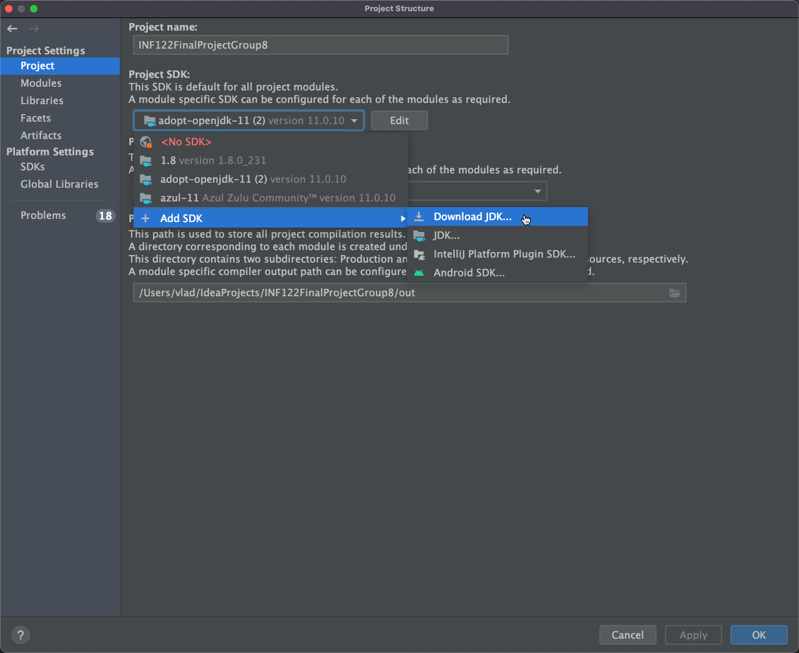
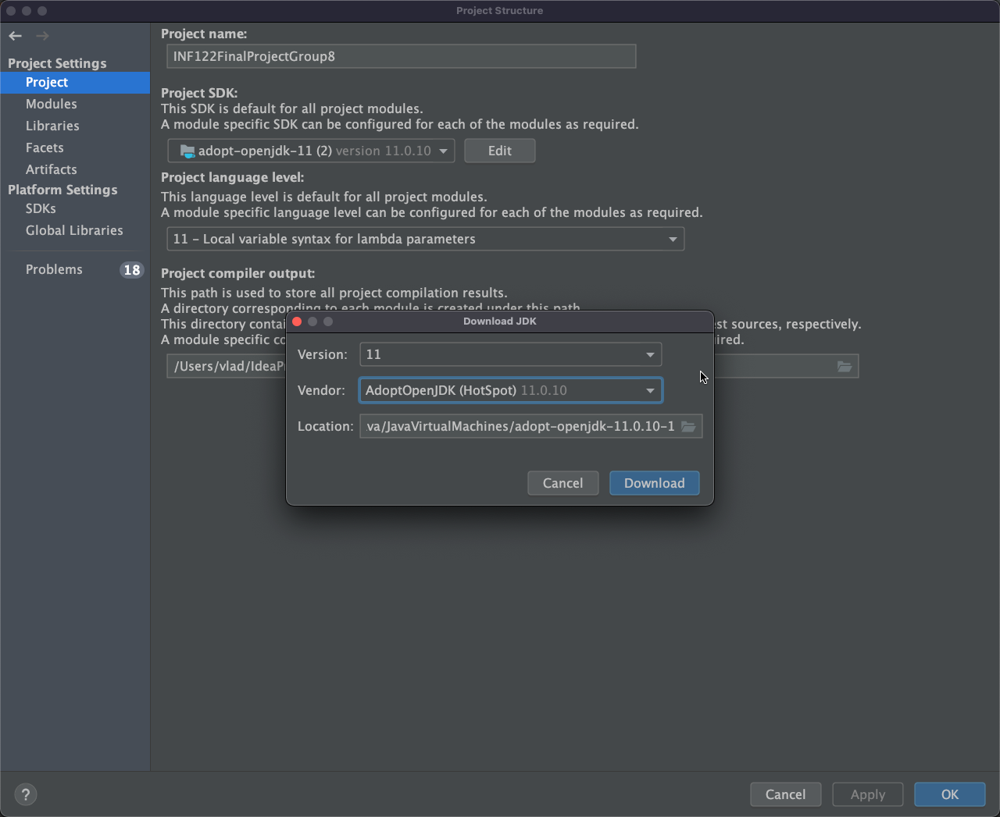
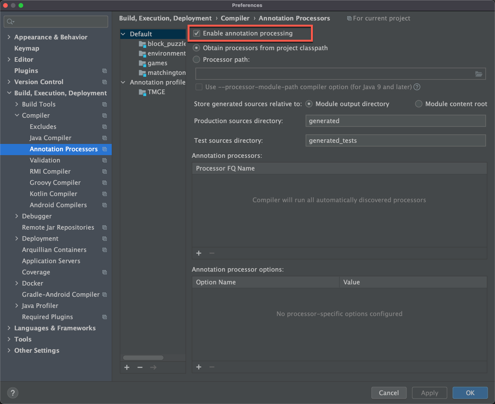
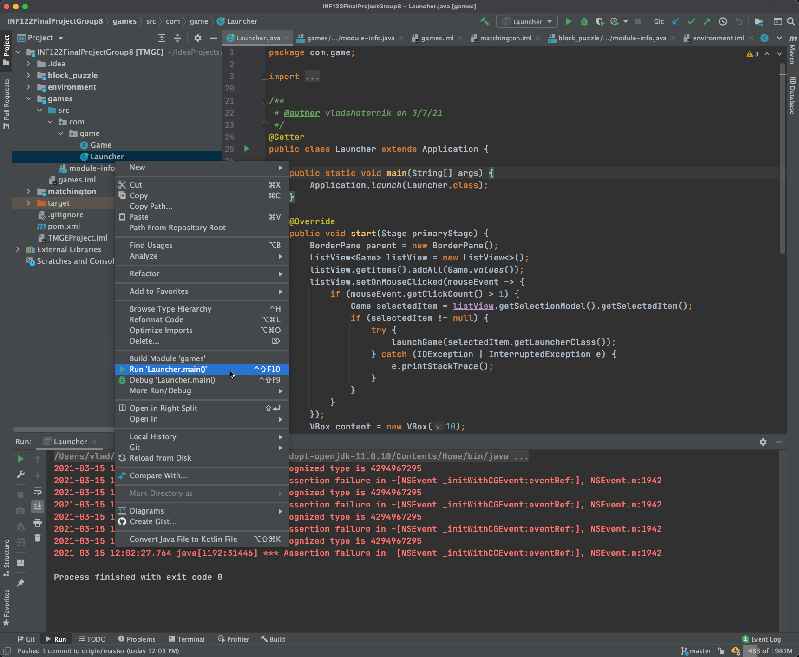
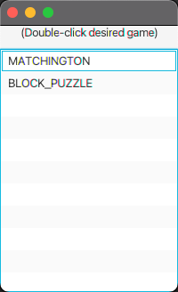
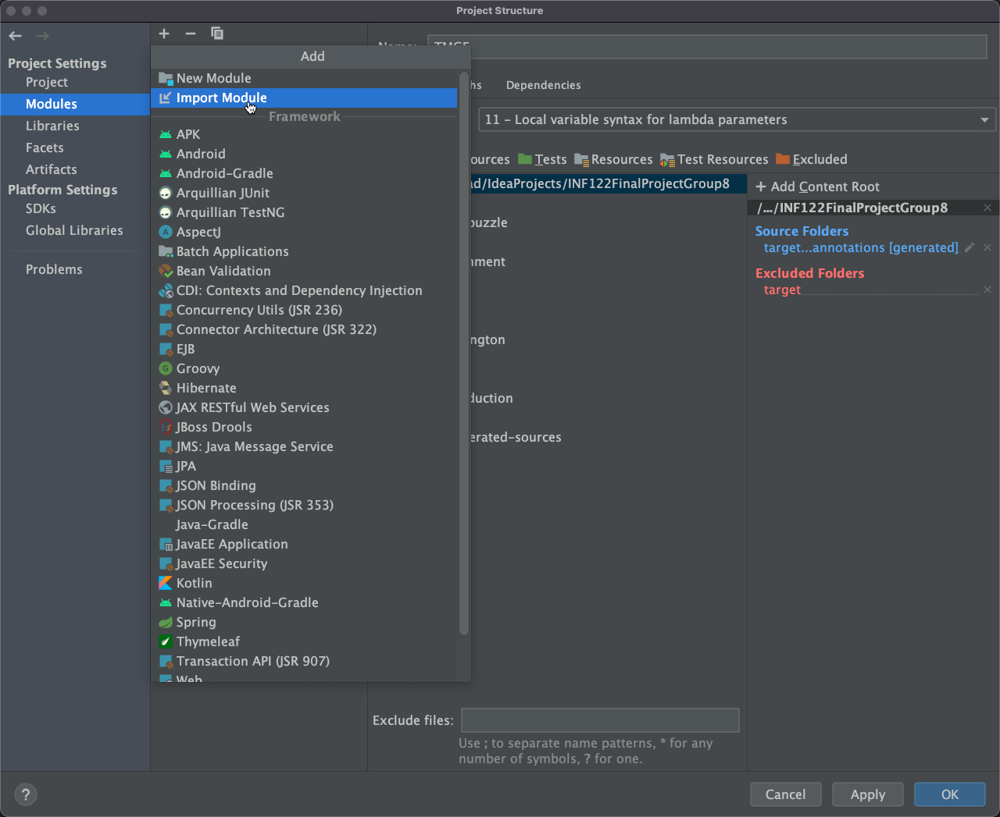
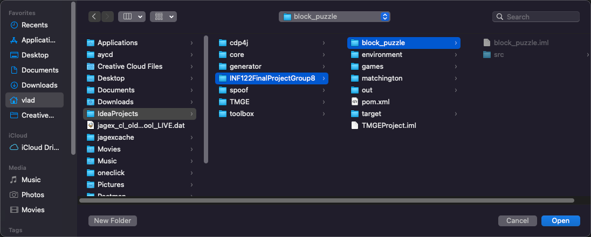
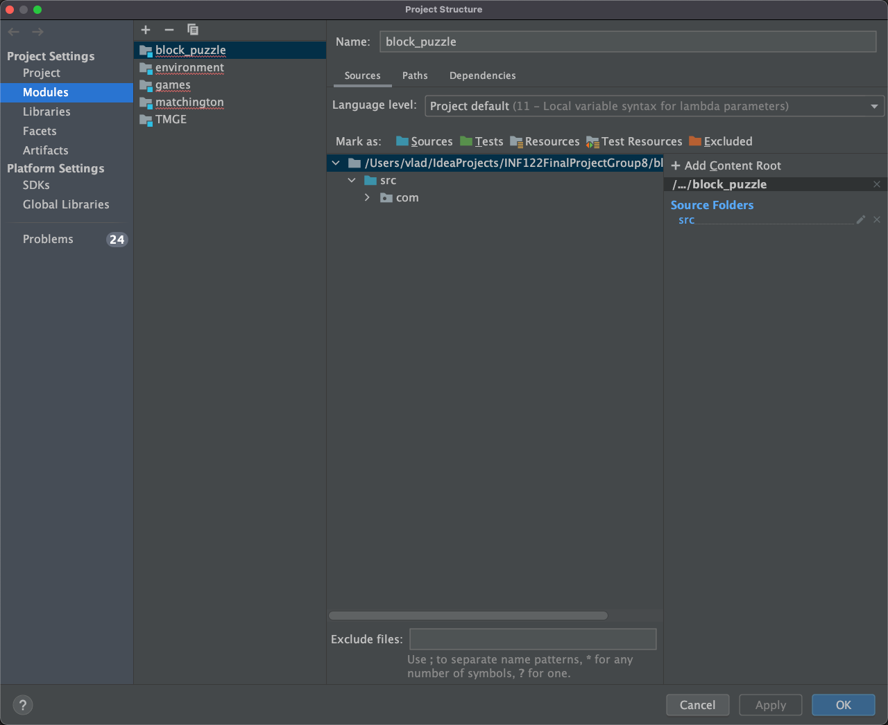
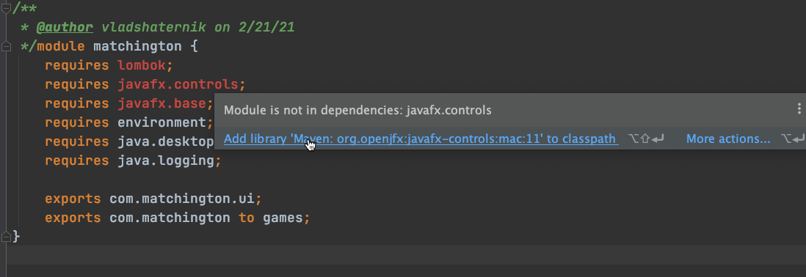
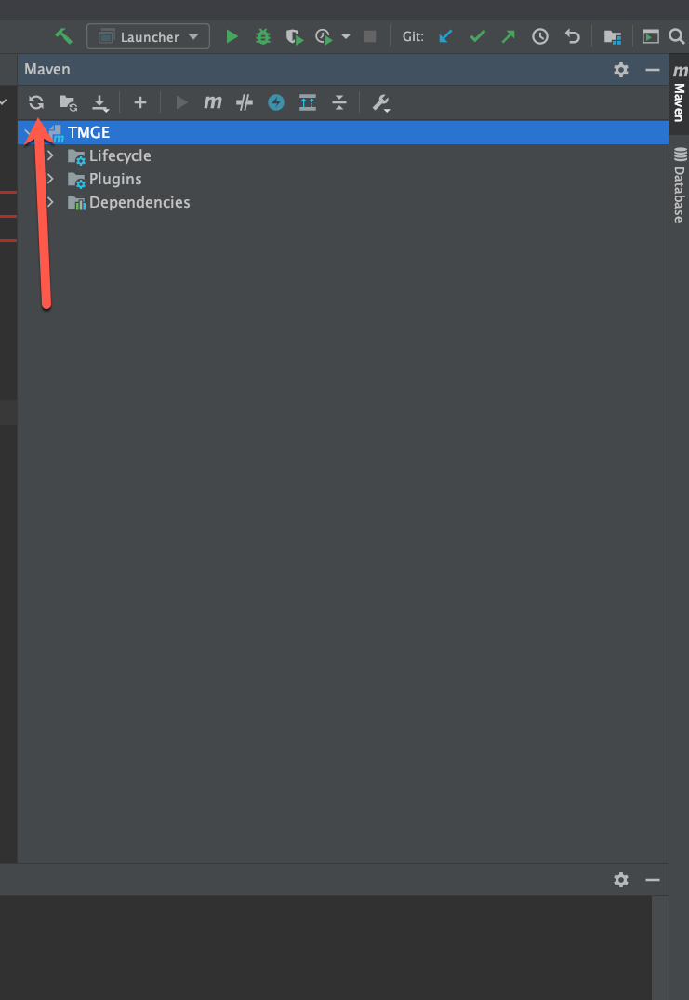

# INF122FinalProjectGroup8

The design and implementation of an extensible Tile-Matching Game Environment (TMGE).
2 games are implemented:

* Matchington (Inspired by CandyCrush)
* Block Puzzle (Inspired by Columns)

## Problem with .jar
Our team was unable to package everything as a single .jar file. There are couple reasons for this. For this assignment we are required to use modules which are introduced since Java 9. With introduction of modules (project Jigsaw) JavaFx is no longer packaged with Java and has to be included separately. Unfortunately, we were not able to figure out how to connect all these pieces togather into a single .jar file. Therefore, this project will need to be launched using source code from IDE.

## How to run from Intellij IDE
1. Clone this project. It is public, so you should not have any problems with that.
2. Go to ```File -> Project Structure -> Project``` and make sure that your Project language level is set to 11. Also, make sure that your Project SDK is also Java 11. We have used ```AdoptOpenJDK (HotSpot) 11.0.10```.

.png)





3. We are using lombok for this project. It requires ```Annotation Processing``` to be enalbed. Go to the ```IntelliJ Settings/Preferences -> Build, Execution, Deployment -> Compiler -> Annotation Processors``` and make sure that ```Enable annotation processing``` is enabled.



4. Wait for IDE to properly index everything.
5. We have created a nice way of launching both games through the UI. Go to the games module and then right click ```src.com.game.Launcher``` and select ```Run 'Launcher.main()'```



6. From here it should be pretty straigh forward how to launch games. Just double-click the desired game and it will launch.



## Troubleshooting
If the IDE does not see some of the modules. Follow the next steps:
1. Go to each one of the 4 modules and delete the .iml file. It was added in order for the graders to be able to easily launch this project. But if it is causing problems they need to be removed and regenerated which you will need to do in the next step.
2. After .iml files are removed go to ```File -> Project Structure -> Modules``` and press the pluss button at the top, select ```Import Module```, and select a folder of the module. Repeat this for all 4 modules ("block_puzzle", "environment", "games", "matchington").







3. Now go to each module ```module-info.java```. You will see that some of the items are red. Hower over them and press ```Add library ... to claspath```. Once you have done that - you should be able to launch the project.



If there are some problems with maven. For example, if the lombok annotations are red. Then try refreshing Maven on the right side of the IDE.


